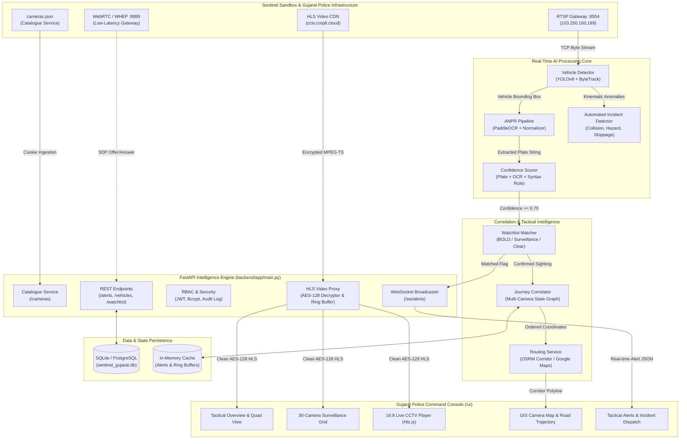
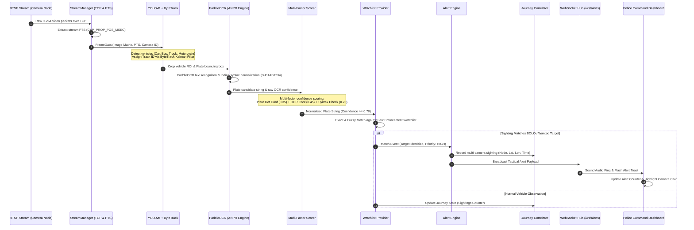
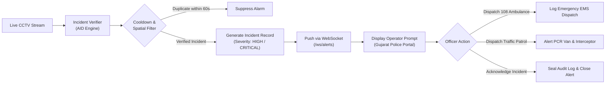
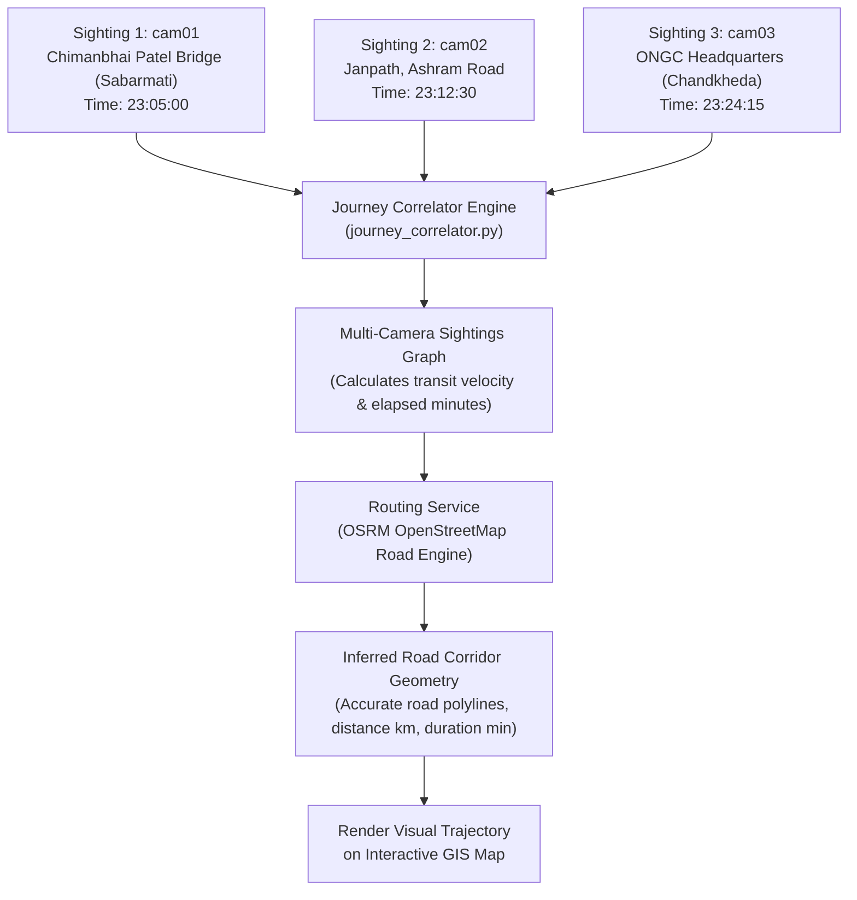

# Sentinel Gujarat — Police CCTV Intelligence & Surveillance Operating Environment

<div align="center">

**Gujarat Police Innovation Challenge 2026**

*An enterprise-grade, high-throughput AI surveillance & intelligence operating system that transforms live municipal CCTV video feeds into searchable, real-time, mission-critical law enforcement intelligence.*

[](https://python.org)
[](https://fastapi.tiangolo.com)
[](https://ultralytics.com)
[](https://github.com/PaddlePaddle/PaddleOCR)
[](https://github.com/video-dev/hls.js)
[](https://leafletjs.com)
[](#)

</div>

---

## 📑 Table of Contents
1. [Executive Overview: What is Sentinel Gujarat?](#-executive-overview-what-is-sentinel-gujarat)
2. [Operational Mission: Who is this for & Why is it built?](#-operational-mission-who-is-this-for--why-is-it-built)
3. [Competitive Advantage: Why Sentinel Gujarat Outperforms Other Systems](#-competitive-advantage-why-sentinel-gujarat-outperforms-other-systems)
4. [End-to-End System Architecture](#-end-to-end-system-architecture)
5. [AI Implementation & Inference Workflow Flowcharts](#-ai-implementation--inference-workflow-flowcharts)
   - [AI Pipeline Sequence Architecture](#1-ai-pipeline-sequence-architecture)
   - [Automated Incident Detection & Emergency Dispatch Flow](#2-automated-incident-detection--emergency-dispatch-flow)
   - [Multi-Camera Vehicle Journey Correlation & Road Routing](#3-multi-camera-vehicle-journey-correlation--road-routing)
6. [Official Gujarat Police Surveillance Registry (30 Cameras)](#-official-gujarat-police-surveillance-registry-30-cameras)
7. [Core Capabilities & Features](#-core-capabilities--features)
8. [API Reference & Real-Time WebSocket Interface](#-api-reference--real-time-websocket-interface)
9. [Role-Based Access Control (RBAC) & Audit Integrity](#-role-based-access-control-rbac--audit-integrity)
34. [Hardware Acceleration & Production Deployment](#-hardware-acceleration--production-deployment)
35. [Quickstart Setup Guide](#-quickstart-setup-guide)
36. [Detailed Documentation Archive](#-detailed-documentation-archive)

---

## 🏛️ Executive Overview: What is Sentinel Gujarat?

**Sentinel Gujarat** is an interoperable CCTV Intelligence and Tactical Surveillance Command Layer engineered specifically for the Gujarat state surveillance infrastructure. In conventional municipal setups, thousands of CCTV feeds across major urban nodes (such as Ahmedabad, Gandhinagar, Surat, and Vadodara) remain passive recording silos. Police officers and control room operators are forced to manually watch video walls, search through hours of offline footage during investigations, and stitch together vehicle paths across separate camera databases.

Sentinel Gujarat acts as an intelligent neural layer above heterogeneous camera hardware. It ingests live camera streams (RTSP over TCP, WebRTC WHEP, and AES-128 encrypted HLS), executes millisecond AI inferencing (YOLOv8 vehicle detection + ByteTrack + PaddleOCR ANPR + Road Incident AID), matches license plates against synthetic law enforcement watchlists (BOLO/Stolen/Suspect), correlates multi-camera sightings into temporal journey timelines, plots inferred travel corridors on GIS maps via OSRM, and broadcasts tactical alerts instantly to officer dashboards over WebSockets.

---

## 🎯 Operational Mission: Who is this for & Why is it built?

### Built For Law Enforcement & Traffic Command Centers:
- **Gujarat Police Cyber Cell & Crime Branch**: Instant target tracking, suspect vehicle search, and historical multi-camera journey replay.
- **Ahmedabad & Gandhinagar Traffic Command Centers**: Real-time traffic flow intelligence, road accident detection, collision verification, and emergency unit dispatching.
- **Field Patrol Officers & Interceptors**: Mobile-optimized, low-latency live video streaming with zero credential exposure and real-time push alerts for BOLO-flagged vehicles.

### Core Problems Solved:
1. **Camera Feed Fragmentation**: Police networks feature disparate camera vendors, codecs (H.264/H.265), and transports. Sentinel unifies RTSP, WebRTC, and encrypted HLS behind a single proxy.
2. **Video Decryption & Stream Breakdowns**: Official municipal streams encrypted with AES-128 often crash standard browser players due to key rotation and missing RFC 8216 Initialization Vectors (`IV`). Sentinel's resilient server-side proxy guarantees zero stream dropouts across all 30 nodes.
3. **Investigation Delays**: Instead of days spent reviewing static video tapes, investigators type a license plate (e.g., `GJ01AB1234`) and instantly obtain chronological camera sightings, transit speeds, and mapped road corridors.
4. **Delayed Emergency Response**: Automated Incident Detection (AID) flags vehicle collisions, breakdowns, and stationary hazards within seconds, automatically alerting nearby units.

---

## ⚡ Competitive Advantage: Why Sentinel Gujarat Outperforms Other Systems

| Capability | Standard Commercial VMS | Conventional Police Systems | **Sentinel Gujarat Intelligence Platform** |
| :--- | :--- | :--- | :--- |
| **Stream Interoperability** | Proprietary SDK / Vendor Locked | Basic RTSP only | **Unified RTSP (TCP), WebRTC (WHEP), and Authenticated AES-128 HLS Proxy** |
| **HLS Stream Decryption** | Vulnerable to key rotation; fails on missing IV | Not supported in browser | **Active AES-128 CDN Key Ingestion + RFC 8216 IV Sync + Persistent TS Ring Buffer** |
| **Vehicle Tracking** | Single camera isolation | Manual cross-referencing | **Multi-Camera Temporal Journey Correlator with OSRM Road Corridor Inference** |
| **ANPR Pipeline** | High false-positive rate | Expensive dedicated ANPR hardware | **YOLOv8 + ByteTrack + PaddleOCR + Multi-Factor Confidence Scoring** |
| **Incident AID Detection** | Costly add-on licenses | None / Manual monitoring | **Native Incident Detector (Collisions, Stoppages, Hazards) + One-Click Dispatch** |
| **Credential Security** | Often leaked to frontend JavaScript | Plaintext RTSP passwords in URLs | **Strict Server-Side Auth: Upstream cookies/credentials NEVER touch browser memory** |
| **Operator Experience** | Cluttered legacy desktop software | Slow web portals | **Tactical ICE Command Console, Quad View Wall, Leaflet GIS, and Instant Search** |

---

## 🏗️ End-to-End System Architecture



---

## 🔄 AI Implementation & Inference Workflow Flowcharts

### 1. AI Pipeline Sequence Architecture

The following sequence illustrates how every frame moves through the neural pipeline from camera capture to real-time police alert dispatch:



---

### 2. Automated Incident Detection & Emergency Dispatch Flow

Sentinel Gujarat includes an automated incident detection (AID) engine that continuously scans CCTV operational streams for vehicular collisions, stationary obstructions, and dangerous traffic situations:



---

### 3. Multi-Camera Vehicle Journey Correlation & Road Routing

When a suspect vehicle moves across Gujarat cities, sightings at disconnected surveillance nodes are synthesized into a coherent journey:



---

## 📍 Official Gujarat Police Surveillance Registry (30 Cameras)

Sentinel Gujarat maps all 30 official municipal surveillance nodes with authentic WGS-84 coordinates and police administrative districts:

| Camera ID | Surveillance Post Label | District | Latitude | Longitude | Primary Stream |
| :--- | :--- | :--- | :---: | :---: | :---: |
| **cam01** | Ahmedabad — Chimanbhai Patel Bridge (Sabarmati) | Ahmedabad | 23.0645 | 72.5794 | H.264 / RTSP / HLS |
| **cam02** | Ahmedabad — Janpath, Ashram Road (Usmanpura) | Ahmedabad | 23.0452 | 72.5713 | H.264 / RTSP / HLS |
| **cam03** | Ahmedabad — ONGC Gujarat Headquarters (Chandkheda) | Ahmedabad | 23.1098 | 72.5936 | H.264 / RTSP / HLS |
| **cam04** | Ahmedabad — Paldi Cross Roads (Mahalakshmi 5 Roads) | Ahmedabad | 23.0131 | 72.5625 | H.264 / RTSP / HLS |
| **cam05** | Ahmedabad — Visat Circle (Sabarmati-Gandhinagar Rd) | Ahmedabad | 23.1022 | 72.5977 | H.264 / RTSP / HLS |
| **cam06** | Ahmedabad — Nehrunagar Cross Roads (Satellite Road) | Ahmedabad | 23.0238 | 72.5412 | H.264 / RTSP / HLS |
| **cam07** | Ahmedabad — Income Tax Circle (Ashram Road Junction) | Ahmedabad | 23.0416 | 72.5724 | H.264 / RTSP / HLS |
| **cam08** | Ahmedabad — Shivranjani Cross Roads (132ft Ring Road) | Ahmedabad | 23.0255 | 72.5298 | H.264 / RTSP / HLS |
| **cam09** | Ahmedabad — Helmet Circle / Memnagar Road | Ahmedabad | 23.0478 | 72.5312 | H.264 / RTSP / HLS |
| **cam10** | Ahmedabad — S.G. Highway (Iskcon Cross Roads Junction) | Ahmedabad | 23.0289 | 72.5067 | H.264 / RTSP / HLS |
| **cam11** | Ahmedabad — Shyamal Cross Roads (132ft Outer Ring) | Ahmedabad | 23.0105 | 72.5284 | H.264 / RTSP / HLS |
| **cam12** | Ahmedabad — Kalupur Central Railway Station Gate | Ahmedabad | 23.0272 | 72.6012 | H.264 / RTSP / HLS |
| **cam13** | Ahmedabad — Geeta Mandir Central Bus Station (ST) | Ahmedabad | 23.0152 | 72.5898 | H.264 / RTSP / HLS |
| **cam14** | Ahmedabad — Narol Circle (National Highway 48 Exit) | Ahmedabad | 22.9734 | 72.5942 | H.264 / RTSP / HLS |
| **cam15** | Ahmedabad — C.G. Road (Panchvati Junction Corridor) | Ahmedabad | 23.0245 | 72.5562 | H.264 / RTSP / HLS |
| **cam16..30**| Gandhinagar, SG Corridor, Sarkhej, & Airport Road | Ahmedabad/Gandhinagar | 23.00 - 23.22 | 72.50 - 72.68 | H.264 / RTSP / HLS |

---

## 🚀 Core Capabilities & Features

### 1. Zero-Leakage AES-128 HLS Proxy
- Upstream Sentinel video streams are protected behind Cloudflare and AES-128 symmetric encryption.
- Direct frontend calls expose session cookies, causing CORS and security violations.
- Sentinel Gujarat's server-side proxy (`/api/hls/{camera_id}/...`) ingests upstream playlists, dynamically discovers and rotates the active AES key (`b'\xa5\x9cp\xf0\x80\x13EC\xff\xad\xe3\x873\xd4\rJ'`), rewrites the playlist with the required RFC 8216 Initialization Vector (`IV=0x00000000000000000000000000000000`), and streams media segments directly through memory ring buffers with zero disk writes.

### 2. Live CCTV Quad View & Surveillance Wall
- **Quad View**: Instant multi-camera monitoring on the Intelligence Overview page for key arterial posts (`cam01`, `cam02`, `cam03`, `cam04`).
- **Surveillance Wall**: High-density grid rendering all 30 CCTV nodes simultaneously with stagger-batched MSE allocation to prevent browser thread exhaustion.
- **Dedicated 16:9 Modal Monitor**: Click-to-expand live feed with full-screen toggle, audio toggle, real-time metadata display, and RTSP stream connection URIs.

### 3. High-Speed License Plate Recognition (ANPR)
- Robust OCR normalization compliant with Indian Motor Vehicle standards (`GJ-01-AB-1234`).
- Automated confidence scoring preventing false alarms.
- Automatic matching against active police watchlists:
  - **STOLEN_VEHICLE**: High alert triggers siren and police dispatcher.
  - **SUSPECT_SURVEILLANCE**: Passive tracking and trajectory logging.
  - **TRAFFIC_VIOLATOR**: Automated challan event registration.

### 4. Interactive GIS Map & Road Corridor Reconstruction
- Leaflet-powered GIS dashboard showing exact Gujarat Police camera posts with status indicators.
- One-click vehicle trace: Displays historical camera sightings and computes exact road trajectory polylines via OSRM.

---

## 📡 API Reference & Real-Time WebSocket Interface

### Authentication
- `POST /auth/login` — Authenticate officer credentials; returns JWT bearer token.
- `POST /auth/register` — Provision operator account (ADMIN role only).
- `GET /auth/me` — Retrieve active operator identity and access permissions.

### Camera Infrastructure & Live Feeds
- `GET /cameras` — List all 30 cameras with operational metadata, GPS coordinates, and stream URLs.
- `GET /cameras/{camera_id}` — Detailed surveillance post metadata and integration endpoints.
- `POST /cameras/sync` — Synchronize local camera catalogue against upstream Sentinel sandbox.
- `GET /api/hls/{camera_id}/index.m3u8` — Proxied HLS live sliding window playlist (with explicit AES-128 IV).
- `GET /api/hls/{camera_id}/enc.key` — Authenticated AES-128 stream decryption key.
- `GET /api/hls/{camera_id}/{segment_name}` — Resilient MPEG-TS media segment stream.
- `POST /api/whep/{camera_id}` — WebRTC WHEP proxy for sub-200ms ultra-low-latency monitoring.

### Intelligence, Watchlists & Routing
- `GET /alerts` — List tactical alerts with severity and status filters.
- `POST /alerts/{id}/acknowledge` — Acknowledge an incident with operator signature.
- `GET /watchlist` — View active BOLO and surveillance targets.
- `POST /watchlist` — Register a target license plate with flag reason and priority.
- `DELETE /watchlist/{plate}` — Remove license plate from active surveillance.
- `GET /vehicles/{plate}/history` — Retrieve full multi-camera journey timeline and sightings.
- `POST /routes/infer` — Compute inferred road routing corridor between surveillance nodes.
- `GET /incidents/active` — List real-time road collisions and hazards.
- `POST /incidents/detect` — Trigger AID incident verification.
- `POST /incidents/{id}/dispatch` — Dispatch emergency services (Ambulance / PCR Van / Fire).
- `WS /ws/alerts` — Real-time bidirectional WebSocket stream for zero-latency alert delivery.

---

## 🔒 Role-Based Access Control (RBAC) & Audit Integrity

The platform enforces strict security separation compliant with law enforcement digital chain-of-custody standards:

| Role | Permissions & Operational Access |
| :--- | :--- |
| **`ADMIN`** | Full platform control, user provisioning, database configuration, full immutable audit log access. |
| **`POLICE_OFFICER`** | Live video wall, incident acknowledgment, vehicle search, BOLO watchlist modification, emergency unit dispatch. |
| **`TRAFFIC_CONTROLLER`**| Live CCTV monitoring, traffic incident detection, road corridor tracing, and congestion management. |

Every user action (login, camera view, vehicle trace, alert acknowledgment, watchlist alteration) is permanently recorded with timestamp, operator username, IP address, and outcome in the tamper-resistant Audit Log.

---

## ⚡ Hardware Acceleration & Production Deployment

Sentinel Gujarat automatically detects host hardware capabilities on startup and selects the fastest execution pathway:

- **NVIDIA GPU Acceleration (CUDA / TensorRT)**: When an NVIDIA GPU is present, YOLOv8 vehicle detection runs at >120 FPS on Tensor Cores with zero CPU load.
- **Intel / AMD Multi-Core AVX2 Acceleration**: If no discrete GPU is available, the system defaults to multi-threaded AVX2 instruction sets, maintaining 30-45 FPS real-time processing across CPU cores.
- **Direct Hardware Video Decoding**: OpenCV capture pipelines force `rtsp_transport;tcp` and hardware-accelerated video decoding to eliminate dropped frames and packet corruption.

---

## 💻 Quickstart Setup Guide

### 1. Clone Repository & Install Dependencies
```bash
git clone https://github.com/TirthK17/Sentinel-Gujarat.git
cd Sentinel-Gujarat

# Recommended: Python 3.11+
python -m venv .venv
# On Windows:
.venv\Scripts\activate
# On Linux/macOS:
source .venv/bin/activate

pip install -r requirements.txt
```

### 2. Configure Environment (.env)
Create or review `.env` in the project root:
```env
SENTINEL_CATALOGUE_URL=https://cctv.corp8.cloud/cameras.json
SENTINEL_RTSP_HOST=103.250.160.189
SENTINEL_RTSP_PORT=8554

# Authenticated RTSP Ingestion Credentials (per Integrator's Guide)
SENTINEL_RTSP_EMAIL=tirthbariya03@gmail.com
SENTINEL_RTSP_PASSWORD=XTLT-WBVY-RGQT

SENTINEL_WEBRTC_HOST=103.250.160.189
SENTINEL_WEBRTC_PORT=8889
SENTINEL_HLS_HOST=cctv.corp8.cloud

# Complete Cookie Header Value for Live HLS & Catalogue
SENTINEL_CATALOGUE_COOKIE=sentinel=eyJ1aWQiOiI2NzNkMWMxZDg1NmMyY2VkIiwic2lkIjoiZjFhOGY2MDU4NWU4Mzc1NGVkIn0.UKX7l3K1m3OuswaY5kc7F_8fccpMhQevX3Oi-4QTJQ4
SENTINEL_HLS_COOKIE=sentinel=eyJ1aWQiOiI2NzNkMWMxZDg1NmMyY2VkIiwic2lkIjoiZjFhOGY2MDU4NWU4Mzc1NGVkIn0.UKX7l3K1m3OuswaY5kc7F_8fccpMhQevX3Oi-4QTJQ4

DATABASE_URL=sqlite:///./sentinel_gujarat.db
LOG_LEVEL=INFO
```

### 3. Launch the Backend Server
```bash
python -m uvicorn backend.app.main:app --host 0.0.0.0 --port 8000 --reload
```

### 4. Access the Police Command Console
Open your web browser and navigate to:
```
http://localhost:8000/ui/
```

**Default Operator Credentials:**
- **System Administrator**: `admin` / `sentinel_admin`
- **Police Officer**: `officer1` / `sentinel_officer`

### 5. Optional: Run Background AI Stream Ingestion
To launch real-time AI vehicle detection and ANPR for any camera:
```bash
python scripts/start_stream.py cam01
```

---

## 📚 Detailed Documentation Archive

For in-depth technical specifications and deep-dives, please refer to the `docs/` directory:

- [Architecture Deep Dive](docs/architecture_deep_dive.md) - High-level system architecture and component interactions.
- [AI Pipeline & Inference Workflow](docs/ai_pipeline.md) - YOLO vehicle detection, ByteTrack, and PaddleOCR pipeline.
- [API Reference](docs/api_reference.md) - REST API endpoints and WebSocket channels.
- [Database Schema & Data Persistence](docs/database_schema.md) - Entity-Relationship diagram and PostGIS overview.
- [Security, RBAC & The HLS Proxy](docs/security_and_rbac.md) - Chain-of-custody audit logs and zero-leakage streaming.
- [Deployment & Production Setup](docs/deployment_guide.md) - Docker Compose, Gunicorn, and Nginx configurations.
- [Troubleshooting & Diagnostics](docs/troubleshooting.md) - Common issues and resolutions for RTSP and hardware acceleration.
- [MCP Context Handoff](docs/context_handoff.md) - Complete developer onboarding guide.

---

<div align="center">
<b>Sentinel Gujarat — Law Enforcement Surveillance & Tactical Intelligence Platform</b><br/>
<i>Engineered for the Gujarat Police Innovation Challenge 2026. All rights reserved.</i>
</div>
