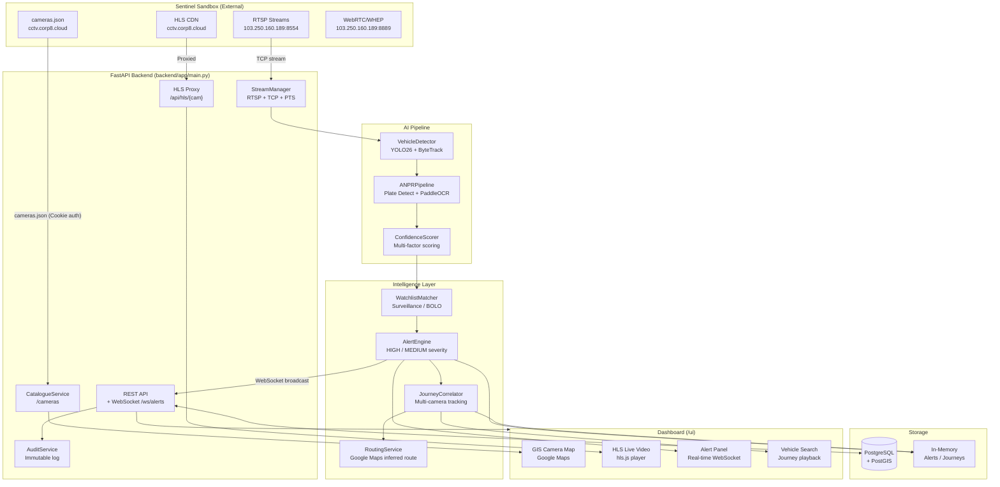
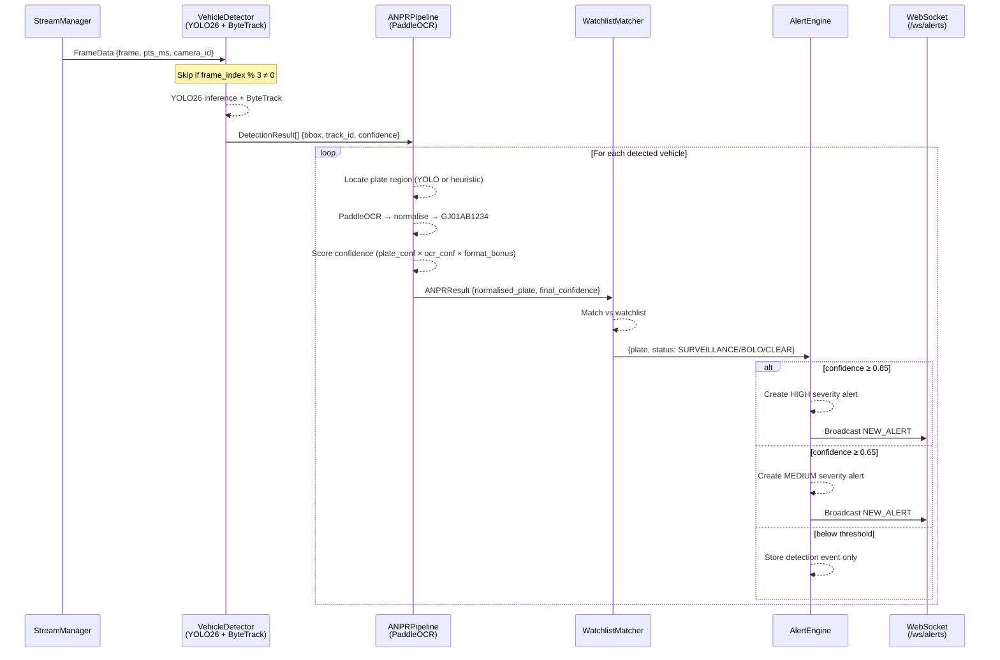
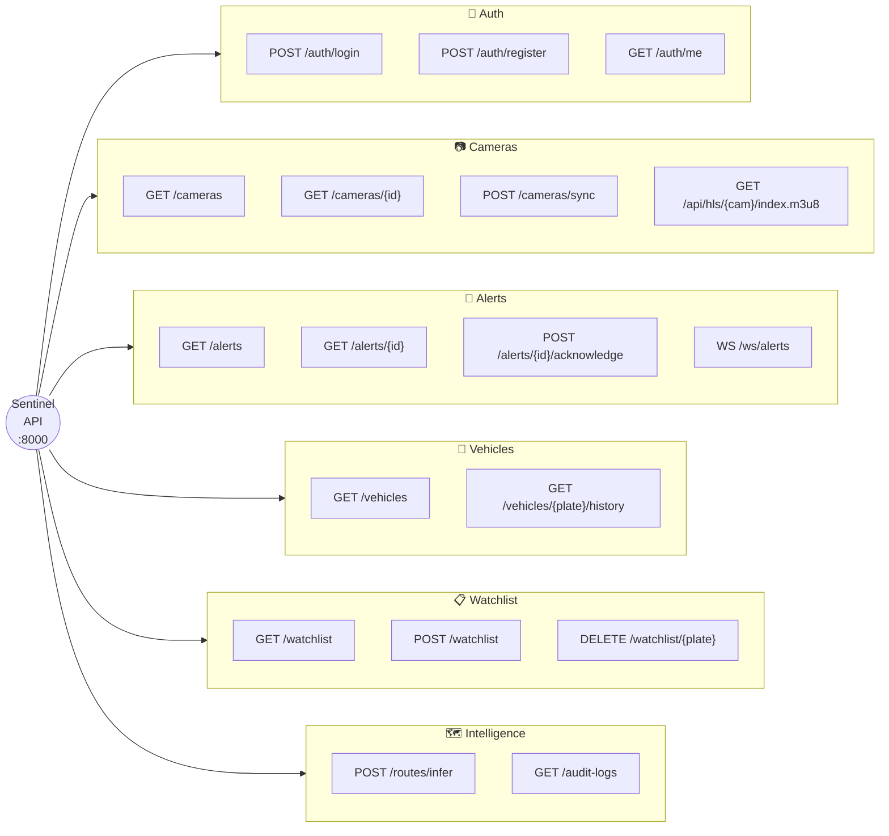

# Sentinel Gujarat — CCTV Intelligence Platform

<div align="center">

**Gujarat Police Innovation Challenge 2026**

*An interoperable AI intelligence layer that converts live CCTV feeds into actionable, searchable security intelligence.*

[](https://python.org)
[](https://fastapi.tiangolo.com)
[](https://ultralytics.com)
[](https://postgis.net)

</div>

---

## What This Is

A complete, working proof-of-concept for the **Sentinel Gujarat CCTV Integration Challenge**. It ingests live RTSP camera feeds from Gujarat Police's Sentinel sandbox, runs real-time vehicle detection and license plate recognition, matches plates against a watchlist, correlates multi-camera sightings into vehicle journeys, and delivers real-time alerts to police officers via a live dashboard.

---

## System Architecture



---

## AI Processing Pipeline



---

## Project Structure

```
sentinel-gujarat/
├── backend/                    ← Python FastAPI backend
│   └── app/
│       ├── main.py             ← All API routes + WebSocket
│       ├── core/               ← config.py · security.py · logging
│       ├── db/                 ← SQLAlchemy session + base
│       ├── models/             ← Pydantic + ORM models
│       └── services/
│           ├── camera/         ← catalogue.py (cameras.json fetcher)
│           ├── streaming/      ← stream_manager.py · hls_proxy.py
│           ├── detection/      ← vehicle_detector.py (YOLO26)
│           ├── anpr/           ← anpr_pipeline.py · ocr_engine.py
│           ├── alerting/       ← alert_engine.py · watchlist_service.py
│           ├── tracking/       ← journey_correlator.py
│           ├── routing/        ← routing_service.py (Google Maps)
│           └── audit/          ← audit_service.py
├── frontend/                   ← Vanilla JS dashboard (served at /ui)
│   ├── index.html · app.js · style.css · hls.min.js
├── ai/
│   └── models/                 ← YOLO .pt weight files
│       ├── yolo26n.pt          ← Primary vehicle detector
│       └── plate_detector.pt   ← Custom plate detection model
├── scripts/                    ← CLI testing tools
│   ├── discover_cameras.py     ← Print camera catalogue
│   ├── test_rtsp.py            ← Test RTSP ingestion
│   ├── test_detection.py       ← Test YOLO on live stream
│   └── test_anpr.py            ← End-to-end ANPR test
├── docs/
│   └── context_handoff.md      ← Full MCP/agent context document
├── .env.example                ← Config template
├── docker-compose.yml          ← PostgreSQL + PostGIS
├── alembic.ini                 ← DB migration config
└── requirements.txt
```

---

## Quick Start

### 1 — Setup

```powershell
# Create & activate virtual environment
python -m venv .venv
.venv\Scripts\Activate.ps1

# Install Python dependencies
pip install -r requirements.txt

# Install PyTorch with CUDA (RTX 4060 / CUDA 12.x)
pip install torch torchvision --index-url https://download.pytorch.org/whl/cu128

# Configure environment
copy .env.example .env
# Open .env and set SENTINEL_CATALOGUE_COOKIE, SENTINEL_RTSP_EMAIL/PASSWORD
```

### 2 — Start PostgreSQL (optional)

```powershell
docker-compose up -d
```

### 3 — Launch the API

```powershell
uvicorn backend.app.main:app --reload --host 0.0.0.0 --port 8000
```

| URL | What |
|---|---|
| `http://localhost:8000/ui` | Live dashboard |
| `http://localhost:8000/docs` | Interactive API docs (Swagger) |
| `http://localhost:8000/health` | Health check |

### 4 — Default Login Credentials

| Username | Password | Role |
|---|---|---|
| `admin` | `sentinel_admin` | Administrator |
| `officer1` | `sentinel_officer` | Police Officer |

---

## API Summary



---

## Milestone Roadmap

```mermaid
gantt
    title Sentinel Gujarat — Milestone Progress
    dateFormat X
    axisFormat M%s

    section Core Ingestion
    M1 Camera Catalogue + RTSP TCP          :done, m1, 0, 1

    section AI Detection
    M2 Vehicle Detection (YOLO26 + GPU)     :done, m2, 1, 2
    M3 ANPR (PaddleOCR + Indian plates)     :done, m3, 2, 3

    section Data & Intelligence
    M4 PostgreSQL + PostGIS Registry        :done, m4, 3, 4
    M5 Watchlist + Alert Engine + RBAC      :done, m5, 4, 5
    M6 Multi-camera Journey + Routing       :done, m6, 5, 6

    section Platform
    M7 FastAPI + JWT Auth + Audit Log       :done, m7, 6, 7
    M8 Dashboard UI (GIS + HLS + Alerts)   :done, m8, 7, 8
```



---

## Sentinel Integration Rules

| Rule | Implementation |
|---|---|
| Always start from `/cameras.json` | `CatalogueService.fetch_catalogue()` — URLs never hardcoded |
| RTSP must use TCP | `OPENCV_FFMPEG_CAPTURE_OPTIONS=rtsp_transport;tcp` in `stream_manager.py` |
| Use PTS, not wall clock | `CAP_PROP_POS_MSEC` read immediately after each `grab()` |
| Never trust `CAP_PROP_FPS` | FPS stored for display only, never used for timing |
| Variable inter-frame intervals | Large PTS gaps → `WARNING`, not error |
| Reconnect with backoff | 2s → 4s → 8s → 16s → 30s max via `_backoff_delay()` |
| Handle decoder join warnings | Pre-IDR H.264/H.265 warnings logged at `DEBUG`, not fatal |
| Mixed H.264/H.265 | Codec detected per-stream from `fourCC` |
| Scene discontinuity (loop point) | PTS backward jump → `SCENE_DISCONTINUITY` log |
| Consume only, don't push | No upload/push to Sentinel gateway |

---

## Security

- Secrets live in `.env` — **never committed** (protected by `.gitignore`)
- All credentials redacted before logging (`redact_credentials()` in `config.py`)
- JWT tokens — 60-minute expiry, HS256
- Full RBAC: ADMIN / POLICE_OFFICER / DEPARTMENT_USER / ANALYST / VIEWER
- Immutable audit log for all sensitive operations
- HLS proxy: browser never sees stream credentials
- Watchlist labeled `SYNTHETIC DEMO DATA` — no real government databases accessed in PoC

---

## Team

**Gujarat Police Innovation Challenge 2026 — Student Hackathon Team**  
Platform: Sentinel Gujarat Portal
