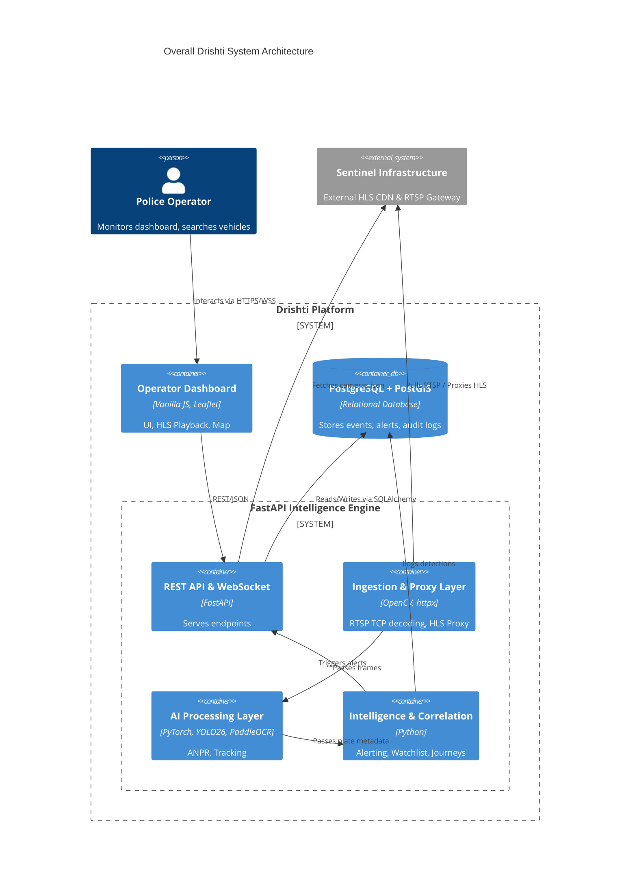
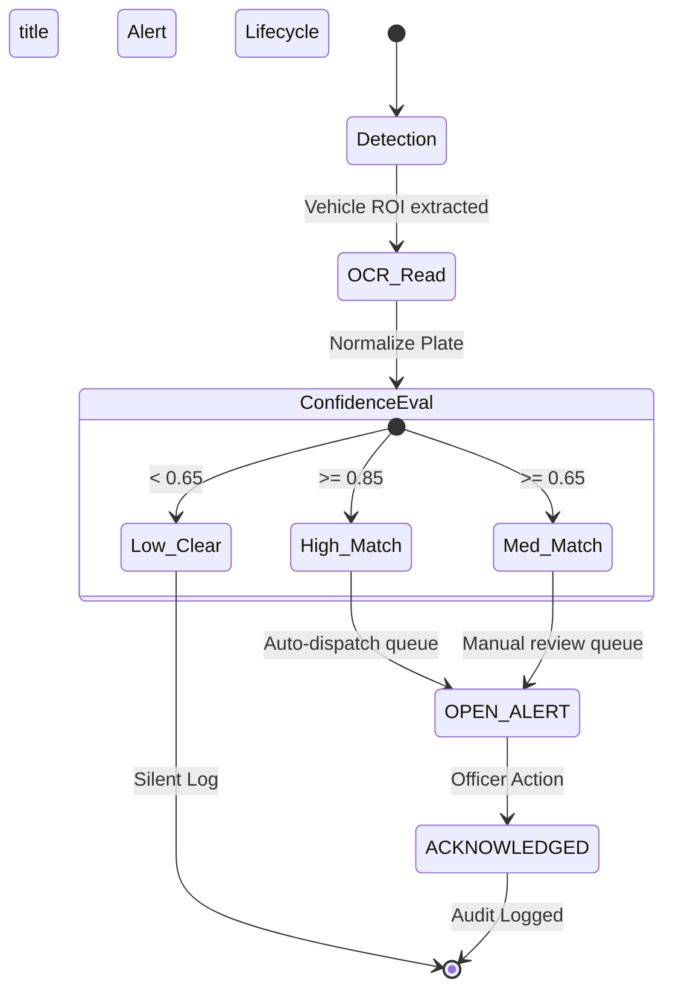
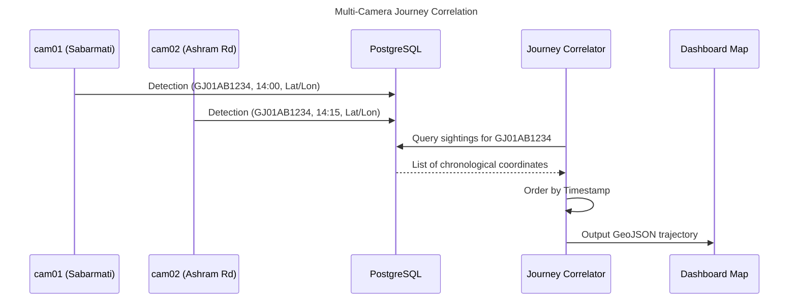
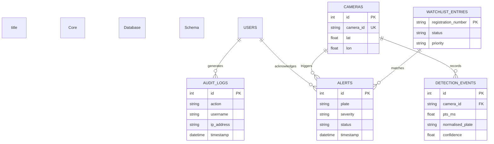
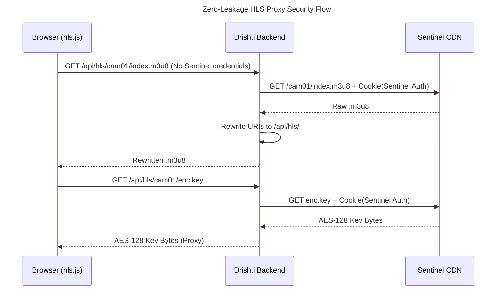
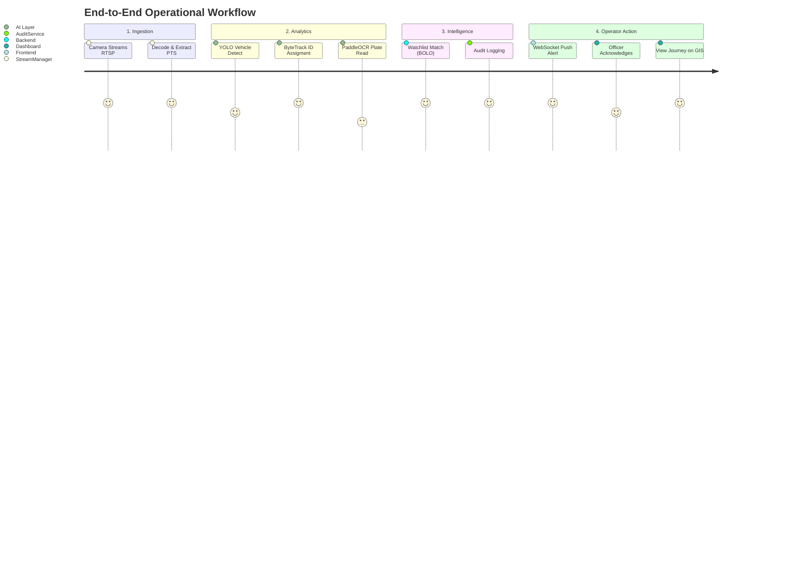

# High-Level Design (HLD): Drishti

## 1. Document Control

- **Project:** Drishti (Sentinel Gujarat)
- **Hackathon:** Gujarat Police Innovation Challenge 2026
- **Document:** High-Level Design (HLD)
- **Version:** 1.0
- **Status:** Final Submission
- **Purpose:** To provide a comprehensive, technically accurate architectural blueprint of the Drishti intelligence platform, detailing both the currently implemented Proof of Concept (PoC) and the proposed statewide production deployment.
- **Intended Audience:** Technical Evaluators, Systems Architects, Law Enforcement Stakeholders, and Future Development Teams.

---

## 2. Executive Summary

**Drishti** (Sentinel Gujarat) is an interoperable, software-defined CCTV Intelligence and Tactical Surveillance Command Layer engineered for the Gujarat Police. 

**The Problem:** Municipal CCTV feeds are currently siloed across proprietary Vendor Management Systems (VMS). Law enforcement relies on manual observation of video walls and tedious post-incident searches, severely limiting real-time interdiction capabilities.

**The Solution:** Drishti acts as a neural layer *above* existing heterogeneous camera hardware. It ingests live camera streams (RTSP, HLS, WebRTC), executes hardware-accelerated AI inferencing (YOLO26 + PaddleOCR), matches license plates against watchlists in real-time, correlates multi-camera sightings into geographic journeys, and broadcasts tactical alerts instantly to operator dashboards.

**Current PoC vs Statewide Vision:**
The current `[IMPLEMENTED]` PoC demonstrates full ingestion, AI pipeline execution, track-caching optimization, and zero-leakage HLS proxying on a single-node architecture. The `[PROPOSED]` statewide vision scales this to 80,000 cameras using an Edge-to-Central topology, extracting metadata at traffic junctions to save 99.9% of bandwidth.

---

## 3. Problem Statement

The Gujarat Police face several critical challenges with the current distributed CCTV infrastructure:
- **Heterogeneous Camera Systems:** Feeds are locked inside different vendor VMS setups (Hikvision, CP Plus, Dahua).
- **Manual Monitoring:** It is humanly impossible to monitor thousands of feeds simultaneously for wanted vehicles.
- **Investigation Delays:** Searching historical footage requires manually pulling DVR drives or watching hours of tape.
- **Cross-Camera Correlation:** Tracking a fleeing suspect across multiple disconnected cameras requires complex manual timeline stitching.
- **Scalability & Bandwidth:** Streaming 80,000 HD video feeds to a central data center requires prohibitive bandwidth and storage.
- **Security:** Exposing encrypted police video to standard browser endpoints often risks credential and stream URL leakage.

Drishti’s architecture is specifically designed to resolve these bottlenecks through automated AI metadata extraction and secure server-side proxying.

---

## 4. Goals and Objectives

**Goals:**
- `[IMPLEMENTED]` **Unified CCTV Access:** Provide a single pane of glass for all state cameras.
- `[IMPLEMENTED]` **Real-Time Analytics (ANPR):** Automate the detection and reading of Indian license plates.
- `[IMPLEMENTED]` **Watchlist Alerts:** Generate zero-latency alerts when a BOLO vehicle is detected.
- `[IMPLEMENTED]` **Journey Correlation:** Automatically map a vehicle's path across multiple cameras.
- `[IMPLEMENTED]` **Secure Access & Auditability:** Ensure strict Role-Based Access Control (RBAC) and immutable chain-of-custody logging.
- `[PROPOSED]` **Cost-Effective Scalability:** Utilize existing camera infrastructure without requiring expensive "smart" ANPR cameras.

**Non-Goals (Current Limitations):**
- Facial Recognition is `[NOT IMPLEMENTED]` as the focus is strictly on vehicular intelligence.

---

## 5. Proposed Solution Overview

Drishti functions as an intelligence overlay. It does not replace the existing CCTV cameras or edge NVRs; it augments them.

1. **Camera Infrastructure:** Existing IP cameras stream to the Sentinel Sandbox.
2. **Integration / Ingestion:** Drishti discovers cameras via a central JSON catalogue and ingests RTSP/HLS streams.
3. **Video Processing:** Frames are decoded, timestamped via PTS, and sampled.
4. **AI Analytics:** YOLO26 detects vehicles, ByteTrack maintains object persistence, and PaddleOCR extracts text.
5. **Watchlist Matching:** Normalized plates are compared against BOLO databases.
6. **Alerts & Journey Correlation:** Matches trigger WebSocket alerts; all detections are logged to build temporal journey maps.
7. **GIS & Dashboard:** Operators view live streams and inferred tactical routes on a Leaflet map.

---

## 6. Reference Architecture / Integration Model

Drishti follows **Model 2: Unified Viewing & Metadata Analytics** blended with **Model 1: Central CCTV Registry**.

**Why this model?**
Replacing existing municipal cameras is cost-prohibitive. By acting as a middleware intelligence layer, Drishti leverages the state's sunk costs in IP cameras. It pulls streams via standard protocols (RTSP/HLS), processes them, and outputs pure metadata (JSON alerts). This separation of concerns ensures that the AI layer can scale independently of the video storage layer.

---

## 7. High-Level System Architecture

The following diagram illustrates the `[IMPLEMENTED]` PoC architecture of Drishti.


*Explanation: This C4 Context diagram shows the distinct separation between the external Sentinel Sandbox, the Drishti FastAPI backend (divided into functional layers), the PostgreSQL database, and the operator UI.*

---

## 8. CCTV INTEGRATION & INTEROPERABILITY

`[IMPLEMENTED]`
- **Camera Catalogue Discovery:** Drishti fetches `cameras.json` from the Sentinel CDN, injecting required authentication cookies dynamically. This avoids hardcoding camera URIs.
- **Protocol Abstraction:** The system supports RTSP (for AI ingestion) and AES-128 encrypted HLS (for human viewing).
- **Heterogeneous Infrastructure:** By relying on standard protocols, Drishti is entirely vendor-agnostic. It does not care if the camera is Hikvision or CP Plus, provided it exposes a standard stream.
- **Failure Handling:** Dead cameras are automatically retried using exponential backoff to prevent overwhelming upstream gateways.

---

## 9. LIVE VIDEO INGESTION

### AI Ingestion Flow `[IMPLEMENTED]`
- **RTSP over TCP:** Drishti forces `rtsp_transport;tcp` via OpenCV. This prevents the severe packet dropping and frame corruption common with UDP on congested police networks.
- **PTS Timing:** Uses `CAP_PROP_POS_MSEC` (Presentation Time Stamp) instead of server wall-clock time. This ensures accurate temporal correlation even if backend processing lags.
- **Frame Sampling:** To preserve GPU resources, the ingestion loop skips frames (e.g., processes 1 out of every 3 frames), maintaining real-time tracking with a 66% compute reduction.

### Secure HLS Playback Flow `[IMPLEMENTED]`
- The official Sentinel CDN provides AES-128 encrypted HLS but requires a session Cookie.
- Passing this cookie to the frontend browser would expose police credentials.
- Drishti solves this via a **Server-Side Proxy**. The frontend requests `/api/hls/cam01/index.m3u8`. The FastAPI backend injects the secure cookie, fetches the stream, rewrites the `.ts` and `enc.key` URIs to point back to itself, and pipes the bytes securely to the browser.

---

## 10. AI / VIDEO ANALYTICS ARCHITECTURE

`[IMPLEMENTED]` This is the core intelligence pipeline.

### YOLO26
- **Purpose:** Ultra-fast object detection.
- **Classes:** Filtered to detect only Cars, Motorcycles, Buses, and Trucks.
- **Hardware:** Runs on NVIDIA CUDA (FP16) or falls back to AVX2 CPU.

### ByteTrack
- **Purpose:** Multi-object tracking.
- **Mechanism:** Assigns a persistent `track_id` (e.g., `ID: 42`) to a vehicle. This allows the system to know that a vehicle in frame 10 is the same vehicle in frame 15, enabling Journey Correlation and Track-Caching.

### Plate Detection & PaddleOCR
- **Localization:** Heuristic fallback crops the bottom 35% of the vehicle bounding box.
- **OCR:** PaddleOCR processes the cropped, grayscaled image to extract text.
- **Normalization:** Custom Indian Motor Vehicle regex logic strips noise and normalizes output (e.g., `GJ-01 AB 1234` → `GJ01AB1234`).

### Track-Caching Optimization (Key Innovation)
- **Problem:** Running PaddleOCR on every frame for a stopped vehicle wastes massive GPU compute.
- **Solution:** Once `track_id=42` yields a confident plate string (≥ 0.65), that string is cached in memory. Future frames for `track_id=42` bypass the OCR engine entirely.

---

## 11. ANPR DATA FLOW

```mermaid
flowchart TD
    title ANPR & Intelligence Data Flow

    RTSP["RTSP Stream (TCP)"] --> FE["Frame Extraction & PTS"]
    FE --> FS{"Frame Skip Filter"}
    FS -- "Process" --> YOLO["YOLO26 Detection"]
    
    YOLO --> BT["ByteTrack Assignment (track_id)"]
    BT --> ROI["Vehicle ROI Crop"]
    
    ROI --> CACHE{"Track Cache Check"}
    CACHE -- "Hit (Conf >= 0.65)" --> RESULT["Cached Plate String"]
    
    CACHE -- "Miss" --> OCR["PaddleOCR Engine"]
    OCR --> NORM["Syntax Normalizer (GJ01AB1234)"]
    NORM --> SCORER["Confidence Scorer"]
    SCORER --> UPDATE["Update Track Cache"]
    UPDATE --> RESULT
    
    RESULT --> WL["Watchlist Matcher"]
    WL -- "Match" --> ALERT["Trigger Alert Event"]
    WL -- "Clear" --> DB[("PostgreSQL: detection_events")]
```
*Explanation: This flowchart demonstrates how raw frames bypass expensive OCR computations using Track Caching, moving directly to watchlist evaluation.*

---

## 12. WATCHLIST & ALERT ENGINE

`[IMPLEMENTED]`
- **Watchlist Structure:** Stored in the database, comprising `registration_number`, `status` (BOLO, STOLEN_VEHICLE, SURVEILLANCE), and `priority`. (Currently populated with synthetic demo data).
- **Alert Generation:** If a normalized plate matches the watchlist, the `AlertEngine` evaluates the confidence score.
- **Severity:** `HIGH` (≥ 0.85 conf) triggers automatic dispatch queues. `MEDIUM` (≥ 0.65 conf) queues for manual officer review.
- **Government Integration:** `[PROPOSED]` Direct REST linkage to VAHAN and eGujCop CCTNS.


*Explanation: State diagram showing how raw detections transition into actionable tactical alerts based on confidence thresholds.*

---

## 13. MULTI-CAMERA VEHICLE JOURNEY CORRELATION

`[IMPLEMENTED]`


*Explanation: When a plate is searched, the backend queries all disparate camera sightings, orders them temporally, and passes them to the GIS layer to reconstruct the suspect's movement.*

---

## 14. GIS & ROUTE INFERENCE

`[IMPLEMENTED]`
- **Map:** Leaflet.js rendering OpenStreetMap tiles.
- **Camera Markers:** All 30 Sentinel nodes are plotted using `lat`/`lon` coordinates extracted from the catalogue.
- **Route Inference:** When visualizing a Vehicle Journey, Drishti connects the historical sighting points. It `[IMPLEMENTED]` uses OSRM (Open Source Routing Machine) or Google Maps APIs to draw actual road-following polylines rather than simple straight lines.

---

## 15. DATABASE ARCHITECTURE

`[IMPLEMENTED]`
Uses PostgreSQL with PostGIS extensions, managed via SQLAlchemy ORM and Alembic migrations. `[IMPLEMENTED]` SQLite graceful fallback exists for local PoC execution.


*Explanation: High-volume `detection_events` track every plate read, while the immutable `audit_logs` table records operator behavior for chain-of-custody compliance.*

---

## 16. API ARCHITECTURE

`[IMPLEMENTED]` Important REST Endpoints (FastAPI):

- **Auth:** `POST /auth/login` (Returns JWT). `GET /auth/me` (Returns user role).
- **Cameras:** `GET /cameras` (List catalogue).
- **Streaming:** `GET /api/hls/{camera_id}/index.m3u8` (Zero-leakage proxy playlist).
- **Alerts:** `GET /alerts` (List open alerts). `POST /alerts/{id}/acknowledge` (Officer acknowledgment).
- **Vehicles:** `GET /vehicles/{plate}/history` (Fetch Journey Correlation data).
- **WebSocket:** `WS /ws/alerts` (Bi-directional real-time alert stream).

---

## 17. FRONTEND ARCHITECTURE

`[IMPLEMENTED]`
- **Technology:** Pure Vanilla JavaScript (ES6+), HTML5, CSS3 Grid/Flexbox. Zero framework overhead (No React/Vue) ensures immediate load times on constrained police networks.
- **Playback:** `hls.js` interprets the backend-proxied MPEG-TS streams.
- **Features:** Dark-mode tactical UI, 2x2 camera grid wall, real-time alert sidebar (via WebSocket), vehicle search portal, and Leaflet GIS map.

---

## 18. SECURITY ARCHITECTURE


*Explanation: Sentinel credentials remain strictly on the backend. The operator browser never has the keys to bypass the Drishti platform and download raw video directly from the government CDN.*

**Controls `[IMPLEMENTED]`:**
- **Authentication:** JWT (JSON Web Tokens).
- **RBAC:** `ADMIN` (manage users, logs), `POLICE_OFFICER` (acknowledge alerts), `TRAFFIC_CONTROLLER` (viewing only).
- **Storage:** Passwords hashed with bcrypt.

**Future / Production `[PROPOSED]`:**
- Enterprise SSO (Active Directory).
- mTLS between edge nodes and central servers.

---

## 19. AUDIT & ACCOUNTABILITY

`[IMPLEMENTED]`
Law enforcement systems require strict digital chain-of-custody. Drishti includes an **Immutable Audit Log**.
- Every sensitive API request passes through `AuditService`.
- Logged actions: `LOGIN`, `VIEW_CAMERA`, `SEARCH_VEHICLE`, `ACK_ALERT`, `ADD_WATCHLIST`.
- Records: Timestamp, Username, Role, IP Address, Action, Resource ID.
- *Security:* The API explicitly does not implement `UPDATE` or `DELETE` endpoints for the `audit_logs` table.

---

## 20. HARDWARE REQUIREMENTS

### Current PoC `[IMPLEMENTED]`
- **Compute:** Standard x86_64 Workstation (8-Core).
- **RAM:** 16GB.
- **GPU:** Single NVIDIA RTX 3060/4060 (CUDA 12.x).
- **Storage:** Local SSD (SQLite/Local Postgres).

### Statewide Production Recommendation `[PROPOSED]`
- **Edge Nodes:** Ruggedized NVIDIA Jetson Orin Nano at major traffic junctions.
- **Regional Servers:** Dual Intel Xeon, 128GB RAM, 4x NVIDIA Tesla L4 GPUs per district HQ.
- **Central Cluster:** High-availability Kubernetes cluster for API hosting and PostgreSQL/Citus database clustering.

---

## 21. NETWORK & BANDWIDTH ARCHITECTURE

`[PROPOSED]` Statewide deployment cannot route 80,000 raw HD RTSP streams to Gandhinagar. The bandwidth cost would be astronomical.

**Bandwidth Reduction Strategy:**
- **Edge Extraction:** Run YOLO/OCR at the regional or edge level.
- **Metadata Transmission:** Instead of sending a 4 Mbps H.264 stream, the edge node sends a 2 KB JSON payload: `{plate: "GJ01AB1234", cam: "cam01", time: 14:00}`.
- **Impact:** 99.9% reduction in wide-area network (WAN) bandwidth requirements. Central UI only pulls video on-demand for manual viewing via the HLS proxy.

---

## 22. STORAGE & RETENTION STRATEGY

### Current PoC `[IMPLEMENTED]`
- Stores all metadata and audit logs indefinitely in PostgreSQL.
- Does not store raw video locally (relies on upstream Sentinel CDN).

### Proposed Production `[PROPOSED]`
- **Video:** Retained on Edge NVRs for 30 days. Pushed to Central Object Storage (AWS S3 / MinIO) *only* if tagged as evidence attached to an alert.
- **Metadata (PostgreSQL):** Plate readings retained for 90 days. Watchlist alerts retained indefinitely.

---

## 23. SCALABILITY TO ~80,000 CAMERAS

```mermaid
graph TD
    title Proposed Statewide Scalability Architecture (Edge to Central)
    
    subgraph Edge Layer (80,000 Cameras)
        C1[IP Camera] --> E1[Edge Node: YOLO Extraction]
        C2[IP Camera] --> E2[Edge Node: YOLO Extraction]
    end
    
    subgraph Regional Layer (District HQs)
        E1 -- "Cropped Image" --> GPU1[GPU Cluster: PaddleOCR]
        E2 -- "Cropped Image" --> GPU1
    end
    
    subgraph Central Intelligence (Gandhinagar)
        GPU1 -- "Metadata (JSON)" --> KAFKA[Apache Kafka Message Bus]
        KAFKA --> API[FastAPI Cluster]
        API <--> DB[(PostgreSQL / Citus)]
        API --> UI[Operator Dashboards]
    end
```
*Explanation: To scale to 80,000 cameras, Drishti `[PROPOSED]` shifts heavy pixel processing (YOLO) to the edge. Regional clusters handle OCR, and only lightweight text metadata reaches the central database via a Kafka message bus, allowing infinite horizontal scaling.*

---

## 24. HIGH AVAILABILITY & DISASTER RECOVERY

`[PROPOSED]`
- **API Redundancy:** FastAPI instances deployed across multiple Availability Zones in Kubernetes.
- **Database:** PostgreSQL set up with streaming replication (Primary-Replica).
- **RTO (Recovery Time Objective):** Target < 5 minutes.
- **RPO (Recovery Point Objective):** Target 0 data loss for alerts via synchronous Kafka commits.

---

## 25. MONITORING & SYSTEM HEALTH

`[PROPOSED]`
Production deployments require observability:
- **Metrics:** Prometheus exporting API latency, GPU utilization, and Frame processing FPS.
- **Dashboards:** Grafana visualizing system health.
- **Log Aggregation:** Fluentd routing backend Uvicorn logs to Elasticsearch (ELK Stack).

---

## 26. DEPLOYMENT ARCHITECTURE

```mermaid
graph TD
    title Containerized Deployment Architecture
    
    NET[Internet / Police Intranet] --> LB[Nginx Reverse Proxy / Load Balancer]
    
    subgraph Docker Compose Host
        LB -- "HTTPS to HTTP" --> GUNI[Gunicorn Process Manager]
        GUNI --> UVI1[Uvicorn Worker 1]
        GUNI --> UVI2[Uvicorn Worker 2]
        
        UVI1 <--> DB[(PostgreSQL)]
        UVI2 <--> DB
        
        UVI1 -- "Spawns Threads" --> AI[YOLO / OCR Workers]
    end
```
*Explanation: The current project uses Docker Compose `[IMPLEMENTED]` for local DB provisioning. Production `[PROPOSED]` utilizes Nginx for SSL termination, routing to Gunicorn managing Uvicorn async workers.*

---

## 27. FAILURE HANDLING & RESILIENCE

`[IMPLEMENTED]` Resilient behaviors active in the codebase:
- **RTSP Connection Drop:** `StreamManager` catches broken pipes and utilizes an exponential backoff loop (2s → 30s) to reconnect without crashing the AI thread.
- **Corrupt Frames:** OpenCV pre-IDR frame warnings are caught and discarded cleanly.
- **GPU Missing:** PyTorch auto-detects missing CUDA and gracefully degrades to AVX2 CPU processing.
- **Database Missing:** FastAPI `get_db_optional` yields `None`, gracefully degrading to in-memory Python collections (deques/dicts) so the UI and WebSockets continue functioning for demos.

---

## 28. DATA FLOW (End-to-End Workflow)


*Explanation: This journey maps the data flow from physical photon capture at the camera lens to an officer clicking "Acknowledge" on the digital dashboard.*

---

## 29. PERFORMANCE & OPTIMIZATION

- **Implemented `[IMPLEMENTED]`:**
  - Frame Skipping (processes 10 FPS instead of 30 FPS).
  - Track-Caching OCR (Bypasses text extraction for stationary/tracked vehicles).
  - FP16 Tensor Core execution (when CUDA is present).
  - Asynchronous FastAPI event loop to prevent network I/O from blocking AI operations.
- **Proposed Production `[PROPOSED]`:**
  - TensorRT model optimization.
  - NVIDIA Triton inference batching.

---

## 30. COST-EFFECTIVE DESIGN

Drishti is highly cost-effective because:
1. **Infrastructure Reuse:** It operates on standard RTSP streams. The government does not need to purchase $5,000 proprietary "Smart ANPR" edge cameras.
2. **Track-Caching:** By avoiding redundant OCR on stationary traffic, hardware compute requirements drop significantly, meaning one GPU can handle multiple junctions.
3. **Open-Source Core:** Leverages PostgreSQL, FastAPI, and Leaflet, avoiding expensive enterprise licensing fees (e.g., Oracle, ESRI).

---

## 31. IMPLEMENTATION ROADMAP

- **Phase 1 (Current PoC) `[IMPLEMENTED]`:** Single-node ingestion, full AI pipeline, zero-leakage proxy, working dashboard, SQLite/PostgreSQL.
- **Phase 2 (Pilot) `[PROPOSED]`:** Deploy at 1 traffic junction (4 cameras). Implement Nginx + SSL. Connect live to VAHAN API.
- **Phase 3 (Regional) `[PROPOSED]`:** Deploy district-level GPU clusters. 
- **Phase 4 (Statewide) `[PROPOSED]`:** Full edge-to-central rollout across 80,000 nodes using Kafka and Kubernetes.

---

## 32. PREREQUISITES & ASSUMPTIONS

- **Network:** Requires reliable TCP connectivity to the Sentinel Gateway.
- **Hardware:** Requires AVX2 (CPU) or CUDA 12.x (GPU) for analytics.
- **Legal:** Integration with VAHAN/eGujCop assumes government policy authorization is granted.

---

## 33. LIMITATIONS

- **Synthetic Watchlist:** The current PoC utilizes a synthetic database of plates for matching. Live VAHAN integration requires government API keys.
- **OCR Accuracy:** PaddleOCR accuracy degrades heavily if camera resolution drops below 720p or in severe weather/low-light conditions.
- **Single Node Limits:** The current codebase orchestrates everything via single-process thread pools. It is not designed to ingest 80,000 streams on a single machine.

---

## 34. FUTURE ENHANCEMENTS

`[PROPOSED]`
- **Facial Recognition (FR):** Expanding the YOLO pipeline to extract facial embeddings for pedestrian tracking.
- **Anomaly Detection:** AI identifying wrong-way driving, accidents, or stationary vehicles in active lanes.
- **Mobile Companion App:** Pushing high-severity WebSocket alerts directly to patrol officer smartphones.
- **Federated VMS Plugin:** Packaging Drishti as a plugin to inject intelligence directly into existing Milestone/Genetec VMS systems.

---

## 35. REQUIREMENTS TRACEABILITY

| Requirement | Drishti Component | Status | Evidence |
|---|---|---|---|
| CCTV Integration | `StreamManager` | `[IMPLEMENTED]` | `streaming/stream_manager.py` |
| Video Analytics | `VehicleDetector` | `[IMPLEMENTED]` | `detection/vehicle_detector.py` |
| ANPR & Tracking | `ANPRPipeline`, `ByteTrack` | `[IMPLEMENTED]` | `anpr/anpr_pipeline.py` |
| Real-time Alerts | `AlertEngine`, WebSockets | `[IMPLEMENTED]` | `alerting/alert_engine.py`, `main.py` |
| GIS Mapping | `JourneyCorrelator`, Leaflet | `[IMPLEMENTED]` | `tracking/journey_correlator.py`, UI |
| Security/Audit | `HlsProxy`, `AuditService`, JWT | `[IMPLEMENTED]` | `core/security.py`, `streaming/hls_proxy.py` |
| Scalability (80k) | Edge-Central Topology | `[PROPOSED]` | Section 23 of this document |

---

## 36. TECHNOLOGY STACK

| Layer | Technology | Purpose | Status |
|---|---|---|---|
| **Backend** | Python 3.13, FastAPI | API & Logic orchestration | `[IMPLEMENTED]` |
| **Streaming** | OpenCV, httpx | TCP RTSP parsing, HLS Proxy | `[IMPLEMENTED]` |
| **AI (Detect)** | PyTorch, YOLO26 | Vehicle detection | `[IMPLEMENTED]` |
| **AI (Track)** | ByteTrack | Multi-object tracking | `[IMPLEMENTED]` |
| **AI (ANPR)** | PaddleOCR | Plate text extraction | `[IMPLEMENTED]` |
| **Database** | PostgreSQL, PostGIS, SQLAlchemy| Persistent storage & spatial queries | `[IMPLEMENTED]` |
| **Frontend** | Vanilla JS, HTML/CSS | Zero-dependency high-speed UI | `[IMPLEMENTED]` |
| **GIS** | Leaflet.js, OSRM | Map rendering, route inference | `[IMPLEMENTED]` |
| **Deployment** | Docker Compose, Uvicorn | Containerization & local serving | `[IMPLEMENTED]` |
| **Production** | Kubernetes, Kafka, Nginx | Scalable messaging & routing | `[PROPOSED]` |

---

## 37. GLOSSARY

- **ANPR:** Automatic Number Plate Recognition.
- **BOLO:** Be On Look Out (Wanted vehicle list).
- **HLS:** HTTP Live Streaming (Secure video transport protocol).
- **PTS:** Presentation Time Stamp (Embedded timestamp in video stream).
- **RBAC:** Role-Based Access Control.
- **RTSP:** Real-Time Streaming Protocol.
- **Track-Caching:** Drishti's proprietary method of skipping OCR for tracked vehicles.
- **YOLO:** You Only Look Once (High-speed object detection algorithm).

---

## 38. FINAL ARCHITECTURE SUMMARY

**Drishti** successfully implements an interoperable intelligence overlay for the Sentinel Gujarat infrastructure. 

**Today (`[IMPLEMENTED]`)**: It proves that a software-defined architecture can securely ingest government CCTV streams (RTSP/HLS), bypass encryption risks via a server-side proxy, execute GPU-accelerated ANPR (YOLO26 + PaddleOCR) efficiently via track-caching, and push real-time tactical alerts to a GIS-enabled police dashboard with immutable audit logging.

**Tomorrow (`[PROPOSED]`)**: By adopting a distributed Edge-to-Central topology, Drishti provides a highly cost-effective roadmap to scale this intelligence across 80,000 cameras. By extracting lightweight JSON metadata at the edge and only relying on the central data center for correlation and matching, it circumvents the prohibitive bandwidth costs that plague traditional VMS systems, delivering a proactive, statewide law enforcement intelligence network.
