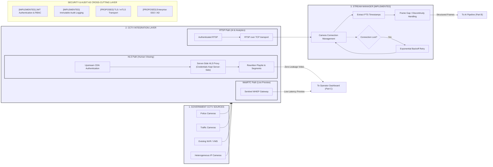
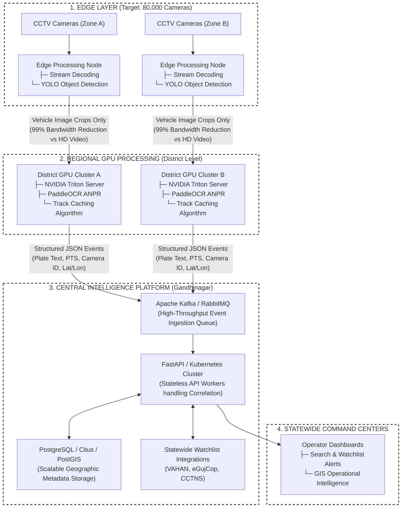

# Drishti — Professional Integration & Workflow Diagrams

> **Note to Technical Evaluators & System Integrators:**  
> This document contains detailed engineering-grade workflow diagrams for the Drishti intelligence platform. To ensure readability and architectural precision, the end-to-end journey has been logically segmented into four connected diagrams.
> 
> **Visual Language Key:**  
> - **Solid Borders**: `[IMPLEMENTED]` Currently functioning in the Drishti codebase.
> - **Dashed Borders**: `[PROPOSED]` Designed for statewide production scale.

---

## PART A: CCTV Sources & Stream Integration

This diagram details how heterogeneous government CCTV streams are ingested, decoded, and securely proxied. It clearly differentiates the raw video stream path intended for AI analytics (RTSP/TCP) from the zero-leakage proxy path designed for human viewing (HLS).

---

## PART B: Detailed AI & ANPR Workflow

This diagram exposes the internal operations of the AI pipeline. It highlights the transition from unstructured video pixels to structured intelligence events, demonstrating the YOLO26 tracking pipeline and the critical **Track-Caching** optimization used to minimize OCR GPU load. It also handles the recovery path for low-confidence reads.

```mermaid
flowchart LR
    %% Styles
    classDef implemented fill:#eef,stroke:#333,stroke-width:2px;
    classDef eventNode fill:#d4edda,stroke:#28a745,stroke-width:2px;
    
    subgraph INGESTION ["4. FRAME ACQUISITION"]
        F_RTSP["RTSP Frame"]
        F_PTS["PTS Timestamp Alignment"]
        F_SKIP["Intelligent Frame Sampling<br>(Process 1 in 3 frames)"]
        
        F_RTSP --> F_PTS --> F_SKIP
    end

    subgraph YOLO ["5. YOLO26 DETECTION"]
        Y_INFER["YOLO26 Inference"]
        Y_FILTER["Vehicle Class Filtering<br>(Car, Truck, Bus, Moto)"]
        
        F_SKIP --> Y_INFER --> Y_FILTER
    end

    subgraph TRACKING ["6. BYTETRACK"]
        T_ASSOC["Temporal Association"]
        T_ID["Persistent Track ID Assignment"]
        
        Y_FILTER --> T_ASSOC --> T_ID
    end

    subgraph ANPR ["7. ANPR & OCR PIPELINE"]
        direction TB
        A_ROI["Vehicle ROI Crop"]
        A_LOC["Plate Detection / Localization"]
        
        A_CACHE_CHK{"Track ID in Cache<br>with Conf >= 0.65?"}
        
        A_OCR["PaddleOCR Text Extraction"]
        A_NORM["Plate Normalization<br>(e.g. GJ01AB1234)"]
        A_CONF["OCR & Syntax Confidence Calculation"]
        
        A_CACHE_HIT["Use Cached Plate Result<br>(Avoids redundant OCR)"]
        A_CACHE_UPD["Update Track Cache"]
        
        A_POOR{"Low Confidence OCR?"}
        A_UNCERTAIN["Mark Uncertain<br>(Do not force identity)"]
        A_RETRY["Wait for Human Review<br>or Better Sighting"]
        
        T_ID --> A_ROI --> A_LOC --> A_CACHE_CHK
        
        A_CACHE_CHK -- "YES" --> A_CACHE_HIT
        A_CACHE_CHK -- "NO" --> A_OCR --> A_NORM --> A_CONF --> A_POOR
        
        A_POOR -- "YES" --> A_UNCERTAIN --> A_RETRY
        A_POOR -- "NO" --> A_CACHE_UPD
    end

    subgraph EVENT_GEN ["8. STRUCTURED INTELLIGENCE EVENT [IMPLEMENTED]"]
        E_STRUCT["Vehicle Intelligence Event<br>├─ Camera ID<br>├─ Timestamp (PTS)<br>├─ Track ID<br>├─ Vehicle Class & Bounding Box<br>├─ Normalized Plate Text<br>└─ Plate Confidence"]
        
        A_CACHE_HIT --> E_STRUCT
        A_CACHE_UPD --> E_STRUCT
    end
    
    E_STRUCT --> TO_PART_3["To Watchlist & Data Layer (Part C)"]

    class INGESTION,YOLO,TRACKING,ANPR,EVENT_GEN implemented;
    class E_STRUCT eventNode;
```

---

## PART C: Alerts, Investigation & GIS Workflow

This diagram maps the flow of structured intelligence. It shows how events interact with the database, how the Watchlist engine triggers WebSockets to operators, the requirement for human verification (preventing AI from making automated law-enforcement decisions), and the synthesis of multiple sightings into a geographic journey.

```mermaid
flowchart LR
    %% Styles
    classDef implemented fill:#eef,stroke:#333,stroke-width:2px;
    classDef proposed fill:#fff,stroke:#333,stroke-width:2px,stroke-dasharray: 5 5;
    
    EVENT["Structured Vehicle Event"] --> WL_MATCH

    subgraph WATCHLIST ["9. WATCHLIST CORRELATION"]
        WL_MATCH{"Plate Match?"}
        WL_SYN["[IMPLEMENTED]<br>Synthetic Demo Data"]
        WL_VAHAN["[PROPOSED]<br>VAHAN / eGujCop"]
        
        WL_SYN -.-> WL_MATCH
        WL_VAHAN -.-> WL_MATCH
        
        WL_MATCH -- "NO (Normal Sighting)" --> DB_STORE["Database Layer:<br>Store Vehicle Sighting"]
        WL_MATCH -- "YES (BOLO/Stolen)" --> DB_STORE
        WL_MATCH -- "YES (BOLO/Stolen)" --> ALERT_EVAL
    end

    subgraph ALERT_ENGINE ["10. ALERT LIFECYCLE"]
        ALERT_EVAL{"Confidence Severity"}
        ALERT_HIGH["High Severity (>= 0.85)"]
        ALERT_MED["Medium Severity (>= 0.65)"]
        
        ALERT_WS["WebSocket Notification Push"]
        ALERT_VERIFY{"Human Operator Verification"}
        
        ALERT_FALSE["Dismiss False Positive"]
        ALERT_CONFIRM["Confirm & Investigate"]
        
        ALERT_EVAL -- "High" --> ALERT_HIGH --> ALERT_WS
        ALERT_EVAL -- "Medium" --> ALERT_MED --> ALERT_WS
        
        ALERT_WS --> ALERT_VERIFY
        ALERT_VERIFY -- "Invalid" --> ALERT_FALSE
        ALERT_VERIFY -- "Valid" --> ALERT_CONFIRM
    end

    subgraph GIS ["11. GIS / JOURNEY INTELLIGENCE"]
        G_SIGHT["Historical Sightings Query<br>(Matches Plate ID across Cameras)"]
        G_ORDER["Chronological Ordering"]
        G_MAP["Leaflet GIS Map Render"]
        G_ROUTE["OSRM Route Inference"]
        
        DB_STORE --> G_SIGHT
        ALERT_CONFIRM --> G_SIGHT
        G_SIGHT --> G_ORDER --> G_MAP --> G_ROUTE
    end

    subgraph OPERATOR ["12. OPERATOR COMMAND CENTRE"]
        O_DASH["Unified Operator Dashboard<br>├─ Live Camera View<br>├─ Vehicle Search<br>└─ GIS Journey Map"]
        O_AUDIT["Immutable Audit Logging<br>(Logs viewing, searching & acks)"]
        
        G_ROUTE --> O_DASH
        ALERT_WS --> O_DASH
        O_DASH --> O_AUDIT
        O_AUDIT --> ALERT_VERIFY
    end

    class WATCHLIST,ALERT_ENGINE,GIS,OPERATOR implemented;
    class WL_VAHAN proposed;
```

---

## PART D: Proposed Statewide Scale Architecture

This diagram departs from the current single-node PoC implementation. It illustrates the target architecture required to scale to 80,000 cameras. Crucially, it demonstrates how raw video bandwidth is eliminated by extracting metadata at the Edge/Regional level and funneling only structured text payloads to the Central Intelligence Platform via Apache Kafka.

