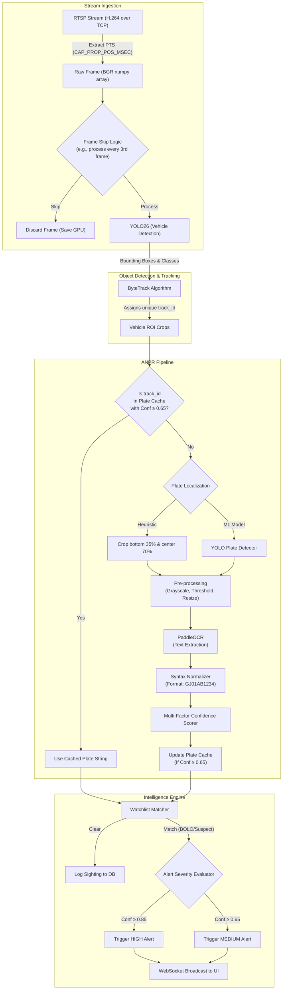

# AI Pipeline & Inference Workflow

> [!TIP]
> Sentinel Gujarat uses a highly optimized, multi-stage AI pipeline to process video frames in real-time, extracting actionable intelligence while minimizing computational overhead.

This document breaks down the core AI components: Vehicle Detection, Multi-Object Tracking, and Automatic Number Plate Recognition (ANPR).

## 1. End-to-End Inference Flowchart

The following flowchart details how a raw video frame from an RTSP stream transforms into a structured alert payload.

## 2. Vehicle Detection (YOLO26)

Sentinel Gujarat utilizes an optimized variant of the YOLO architecture (referred to as YOLO26 nano in the codebase, building on YOLOv8/v11 principles).

### Key Features:
- **Class Filtering**: The model is configured to only output specific COCO classes relevant to traffic: `car(2)`, `motorcycle(3)`, `bus(5)`, `truck(7)`. Pedestrians and animals are ignored to save downstream processing.
- **Hardware Acceleration**: The `VehicleDetector` class automatically detects hardware (`torch.cuda.is_available()`) and uses Tensor Cores (FP16 precision) on NVIDIA GPUs. If a GPU is not found, it gracefully degrades to CPU execution utilizing AVX2 instructions.
- **Frame Skipping**: Processing 30 frames per second is unnecessary for vehicles that remain in the field of view for several seconds. `YOLO_FRAME_SKIP=3` means we process ~10 FPS, cutting compute requirements by 66% with negligible tracking loss.

## 3. Multi-Object Tracking (ByteTrack)

Bounding boxes alone are insufficient. We must track the *same* vehicle across multiple frames to associate it with a coherent journey and optimize OCR.

Sentinel integrates **ByteTrack**, a simple, fast, and strong multi-object tracker.
- **Kalman Filter**: ByteTrack uses a Kalman filter to predict the next location of a bounding box.
- **Data Association**: It associates predicted boxes with actual YOLO detections using Intersection over Union (IoU) and appearance metrics.
- **Benefit**: It assigns a persistent `track_id` (e.g., `Car #42`) that remains constant as long as the vehicle is in the frame.

## 4. ANPR Pipeline & OCR Engine

The Automatic Number Plate Recognition (ANPR) subsystem is a multi-stage process designed for the unique challenges of Indian license plates.

### Stage 1: Plate Localization
Before reading text, we must isolate the license plate.
- **Primary Method**: If `plate_detector.pt` is provided, a secondary YOLO model detects the precise bounds of the plate.
- **Heuristic Fallback**: In the absence of a plate model, the system crops the bottom 35% and central 70% of the vehicle bounding box, which statistically covers >90% of front/rear bumper plate placements.

### Stage 2: PaddleOCR Extraction
We use **PaddleOCR**, specifically chosen for its superior performance on diverse fonts and slightly skewed text compared to Tesseract.
- The plate crop is converted to grayscale, thresholded to increase contrast, and passed to PaddleOCR.

### Stage 3: Normalization
Raw OCR output is messy (`GJ 01 AB - 1234`, `GJO1AB1234`). The `ocr_engine.py` includes a custom normalizer:
- Removes all spaces, dashes, and special characters.
- Converts common OCR mistakes (e.g., `O` to `0`, `I` to `1`) based on position using Indian Motor Vehicle regex rules (`^[A-Z]{2}[0-9]{1,2}[A-Z]{1,3}[0-9]{4}$`).

### Stage 4: Multi-Factor Confidence Scoring
We do not rely solely on PaddleOCR's confidence score. The `ConfidenceScorer` aggregates:
1. **Detection Confidence**: How sure is YOLO that this is a vehicle/plate?
2. **OCR Confidence**: How clear are the characters?
3. **Syntax Validity**: Does the normalized string pass the regex test? (e.g., `GJ01AB1234` gets a massive bonus, `XX99YY00` gets penalized).

This composite score (0.0 to 1.0) dictates whether an alert is generated.

### Stage 5: Track Caching (The Secret Weapon)
Running PaddleOCR is the most expensive part of the pipeline.
- If a vehicle (`track_id=42`) stops at a red light for 30 seconds, running OCR on it 300 times is a waste.
- **The Cache**: Once `track_id=42` yields a plate string with a confidence score ≥ 0.65, that string is cached in memory.
- For all subsequent frames where `track_id=42` is detected, the system bypasses the entire ANPR pipeline and instantly returns the cached plate, freeing up GPU resources for new vehicles.
