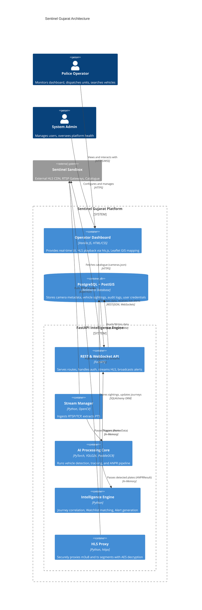

# Architecture Deep Dive

> [!NOTE]
> This document provides an in-depth look at the architecture of the Sentinel Gujarat Platform, detailing the interaction between the FastAPI backend, pure JS frontend, and PostgreSQL integration.

## High-Level Component Architecture

The Sentinel Gujarat platform is designed as a distributed, high-throughput intelligence layer operating above the existing Gujarat Police CCTV network. It strictly separates video ingestion, AI inference, intelligence correlation, and the operator dashboard into distinct layers.

## Backend Architecture: FastAPI Intelligence Engine

The backend is structured using Domain-Driven Design (DDD) principles. It is built entirely asynchronously using FastAPI and Uvicorn, though computationally heavy AI tasks are intelligently threaded to prevent event loop blocking.

### Core Modules

#### 1. Ingestion Layer (`services/streaming/`)
- **`StreamManager`**: Initiates `cv2.VideoCapture` with forced TCP transport (`rtsp_transport;tcp`). It reads the `CAP_PROP_POS_MSEC` property to extract the Presentation Time Stamp (PTS), which is critical because wall-clock time is unreliable for real-time video analytics. It features an exponential backoff reconnect mechanism (2s -> 30s) if a camera node drops.
- **`HlsProxy`**: A critical security component. The official Sentinel HLS CDN requires a cookie for authentication. Passing this cookie to the frontend exposes it to XSS and allows raw video downloading. The `HlsProxy` sits in the middle, intercepting `/api/hls/...` requests, injecting the server-side cookie, modifying the `.m3u8` manifest to point back to the proxy, and piping the `.ts` and `enc.key` files back to the browser safely.

#### 2. AI Pipeline Layer (`services/detection/` & `services/anpr/`)
- Frames are sampled (e.g., `YOLO_FRAME_SKIP=3`) and passed to the `VehicleDetector`.
- **Thread Safety**: Model inference happens in a separate thread pool (`ThreadPoolExecutor`) so it does not block FastAPI's async event loop.
- Detections are paired with ByteTrack IDs.
- Valid vehicle crops are passed to the `ANPRPipeline` which utilizes `PaddleOCR`.
- **Track Caching**: A major optimization. Once a track ID yields a high-confidence plate (≥0.65), the string is cached. Future frames for that track bypass OCR, vastly reducing GPU load.

#### 3. Intelligence & Correlation Layer (`services/alerting/`, `services/tracking/`, `services/routing/`)
- **`WatchlistMatcher`**: Compares normalized plates against local databases (PoC uses `SyntheticWatchlistProvider`).
- **`AlertEngine`**: Evaluates confidence. High confidence (≥0.85) triggers a `HIGH` priority alert. Medium confidence (≥0.65) triggers a `MEDIUM` alert for manual review. Alerts are broadcast immediately via the `WebSocket Hub`.
- **`JourneyCorrelator`**: When a vehicle is seen across multiple cameras, it builds a spatiotemporal graph.
- **`RoutingService`**: Takes the correlator's output (Lat/Lon pairs) and infers the likely road taken using the Google Maps Directions API, outputting a GeoJSON polyline for the frontend GIS map.

#### 4. Security & Audit Layer (`services/audit/`, `core/security.py`)
- Standard JWT (JSON Web Tokens) with a 60-minute expiry are used for stateless API auth.
- **Immutable Audit Log**: Every sensitive action (logging in, viewing a camera, acknowledging an alert, searching a vehicle) writes a record to the `audit_logs` table. This ensures chain-of-custody compliance for law enforcement.

## Frontend Architecture: Pure Vanilla JS

To maintain zero dependencies and ultra-fast load times, the frontend is a single-page application built with Vanilla JS, HTML, and CSS.

### Components

1. **Dashboard Shell (`index.html` & `style.css`)**: Implements a dark-mode, tactical police interface. It uses CSS Grid for the quad-view and flexbox for the sidebar.
2. **State Management (`app.js`)**:
   - Manages the WebSocket connection to `/ws/alerts`.
   - Maintains a local cache of the camera catalogue.
   - Handles JWT token injection into standard `fetch()` API calls.
3. **Video Playback (`hls.min.js`)**: 
   - Uses the widely supported `hls.js` library.
   - Points to our backend's proxy: `hls.loadSource('/api/hls/' + cameraId + '/index.m3u8')`.
   - `hls.js` natively handles the AES-128 decryption provided the proxy passes the key correctly.
4. **GIS Mapping (Leaflet)**:
   - Renders OpenStreetMap tiles.
   - Plots camera markers based on `lat`/`lon` from `cameras.json`.
   - Draws OSRM/Google Maps inferred routes as vector polylines when tracking a suspect vehicle.

## Database Integration: PostgreSQL & PostGIS

The system uses SQLAlchemy as its ORM, and Alembic for schema migrations.

- **Tables**: `cameras`, `detection_events`, `vehicle_journeys`, `alerts`, `watchlist_entries`, `users`, `audit_logs`.
- **PostGIS**: While the PoC uses standard Float columns for Lat/Lon, the production architecture incorporates PostGIS extensions to perform high-speed spatial queries (e.g., "Find all sightings within 5km of coordinate X in the last hour").
- **Graceful Degradation**: The API backend is designed to run in-memory if the `DATABASE_URL` is missing or fails to connect, utilizing Python `deque` and dictionaries. This allows for rapid deployment in constrained environments or during hackathon demonstrations without requiring full Docker stack initialization.
