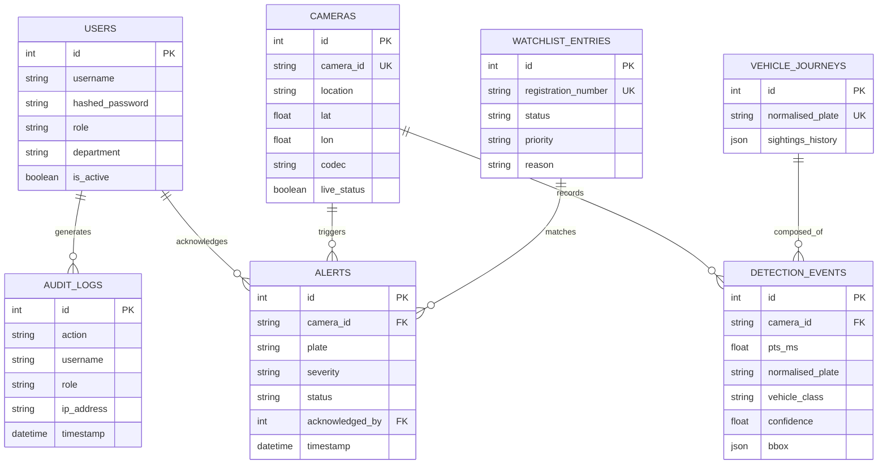

# Database Schema & Data Persistence

> [!NOTE]
> Sentinel Gujarat uses PostgreSQL for persistent, relational data storage, with PostGIS extensions planned for advanced spatial queries. The API interacts with the database via SQLAlchemy ORM.

## 1. Entity-Relationship (ER) Diagram

## 2. Table Breakdown

### `users`
Stores operator credentials. Passwords are encrypted using `bcrypt`.
- **Roles**: `ADMIN`, `POLICE_OFFICER`, `TRAFFIC_CONTROLLER`.

### `cameras`
Acts as a persistent cache of the Sentinel Catalogue. While the system fetches `cameras.json` from the upstream CDN, it saves the structure here to relate historical detections even if a camera is removed from the CDN.

### `detection_events`
The highest volume table. Every time the ANPR pipeline confidently reads a plate (≥0.65), a row is inserted here.
- Includes `pts_ms` (stream time) to ensure exact temporal ordering regardless of backend processing lag.

### `vehicle_journeys`
An aggregated view of `detection_events`. Instead of querying millions of rows to find a car, this table stores a JSON array (`sightings_history`) for each unique plate, updated on every new detection. This allows sub-millisecond retrieval of a vehicle's entire path across Gujarat.

### `alerts`
Stores actionable events generated by watchlist matches or Incident Detection (AID).
- Lifecycle: `OPEN` -> `ACKNOWLEDGED`.
- Links back to the `user` who acknowledged it for accountability.

### `watchlist_entries`
The list of plates the system is actively hunting.
- Statuses: `STOLEN`, `BOLO` (Be On Look Out), `SUSPECT_SURVEILLANCE`.
- In production, this table is synced with external databases (e.g., eGujCop, VAHAN).

### `audit_logs`
The immutable ledger. Every read/write action by an operator is logged here. It has no `UPDATE` or `DELETE` API endpoints, ensuring chain-of-custody integrity for court evidence.

## 3. In-Memory Graceful Degradation (PoC Mode)

For the Hackathon PoC, requiring a full Docker PostgreSQL setup can be cumbersome for quick demos. 
The architecture supports graceful degradation:
- If `DATABASE_URL` is omitted in `.env`, the FastAPI dependency `get_db_optional` yields `None`.
- Service layers automatically fallback to using Python `deque` (for alerts/logs) and dictionaries (for users/journeys).
- This ensures the AI pipeline and WebSocket broadcasting work flawlessly even without persistent storage.
