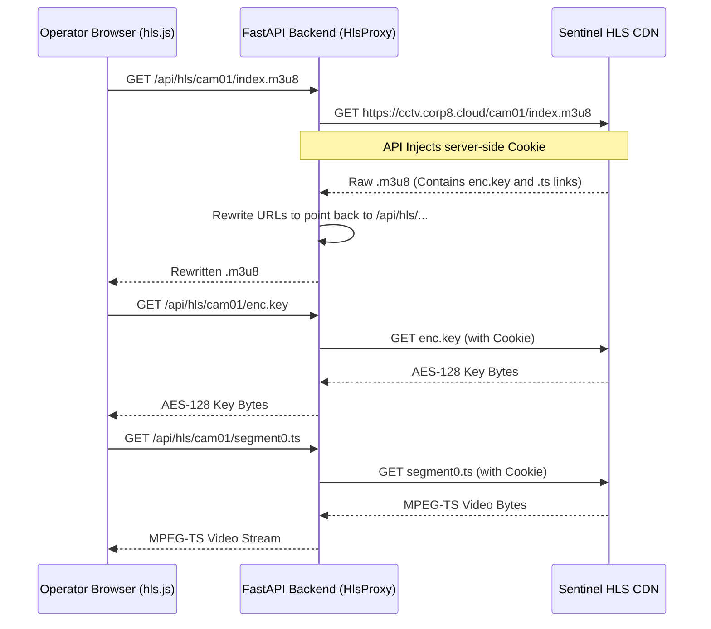

# Security, RBAC & The HLS Proxy

> [!IMPORTANT]
> Given the sensitive nature of police surveillance, Sentinel Gujarat implements strict server-side security, robust Role-Based Access Control (RBAC), and an immutable audit trail.

## 1. Role-Based Access Control (RBAC)

The system enforces authorization via JWT (JSON Web Tokens).

| Role | Description | Allowed Actions |
|---|---|---|
| **`ADMIN`** | System Administrator | Full access. Manage users, modify watchlist, view raw audit logs, force catalogue syncs. |
| **`POLICE_OFFICER`** | Standard Operator | View live streams, acknowledge alerts, search vehicle journeys, dispatch units. Cannot alter logs or manage users. |
| **`TRAFFIC_CONTROLLER`** | Traffic Management | View live streams, monitor congestion, run inferred routes. Cannot modify the BOLO watchlist. |

In the FastAPI code, endpoints are protected using the `require_role` dependency:
```python
@router.post("/alerts/{id}/acknowledge")
async def acknowledge(
    id: str, 
    user: User = Depends(require_role(["ADMIN", "POLICE_OFFICER"]))
):
    ...
```

## 2. Immutable Audit Log

Law enforcement platforms require strict digital chain-of-custody. 

Every sensitive action passes through the `AuditService`:
- `LOGIN` (Success / Failure)
- `VIEW_CAMERA`
- `SEARCH_VEHICLE`
- `ACK_ALERT`
- `ADD_WATCHLIST`

**Log Structure**:
```json
{
  "timestamp": "2026-09-15T15:00:00Z",
  "username": "officer1",
  "role": "POLICE_OFFICER",
  "action": "SEARCH_VEHICLE",
  "resource_id": "GJ01AB1234",
  "ip_address": "192.168.1.45",
  "outcome": "SUCCESS"
}
```
*Note: The API does not expose any DELETE or UPDATE methods for the audit log.*

## 3. The Server-Side HLS Proxy (Zero-Leakage Architecture)

### The Problem
The official Sentinel HLS CDN (`cctv.corp8.cloud`) is protected by AES-128 encryption and requires a session Cookie (`SENTINEL_HLS_COOKIE`). 
If we pass this cookie to the frontend browser so `hls.js` can fetch the video directly, we expose the credentials. An attacker could extract the cookie and download raw video footage from the CDN outside the platform.

### The Solution: Backend Proxy
Sentinel Gujarat never exposes upstream credentials to the client.



By streaming the bytes through our backend proxy using `httpx.AsyncClient`, the browser gets standard HTTP streams without ever knowing the authentication secrets of the Sentinel infrastructure.
